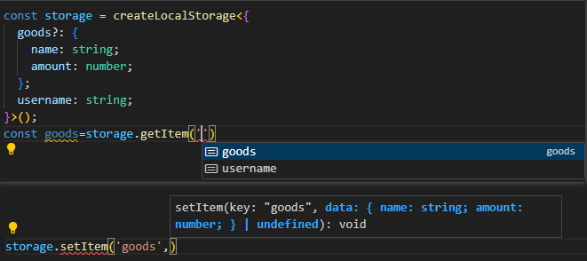

# soon-storage

**A type-safe storage wrapper for localStorage , sessionStorage .**


<!--  -->

## Definition
```ts

export declare function createLocalStorage<T extends {
    [key: string]: any;
}>(): {
    getItem: <Key extends keyof T & string>(key: Key) => Extract<T[Key], undefined> extends never ? T[Key] : Exclude<T[Key], undefined> | null;
    setItem: <Key extends keyof T & string>(key: Key, data: T[Key]) => void;
    removeItem: (key: keyof T & string) => void;
    clear: () => void;
};


export declare function createSessionStorage<T extends {
    [key: string]: any;
}>(): {
    getItem: <Key extends keyof T & string>(key: Key) => Extract<T[Key], undefined> extends never ? T[Key] : Exclude<T[Key], undefined> | null;
    setItem: <Key extends keyof T & string>(key: Key, data: T[Key]) => void;
    removeItem: (key: keyof T & string) => void;
    clear: () => void;
};

```


